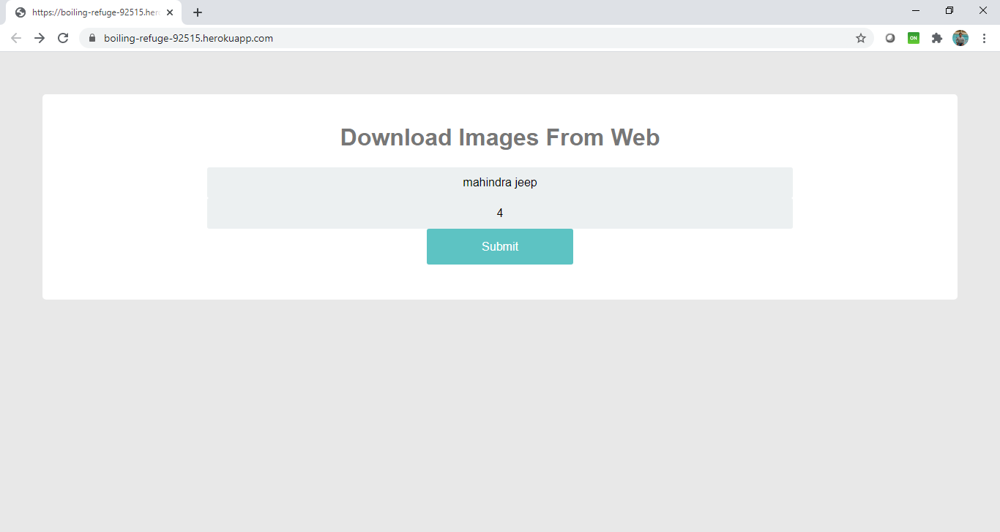
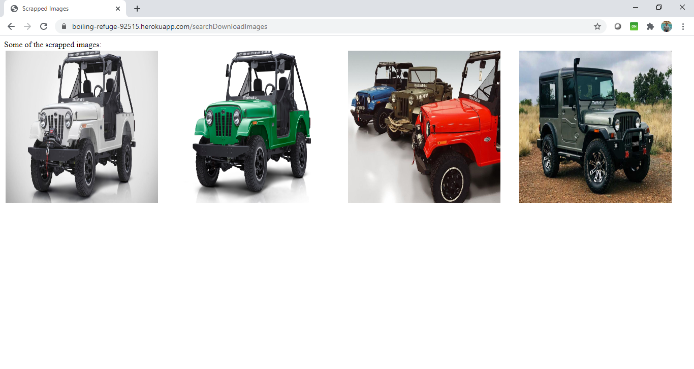
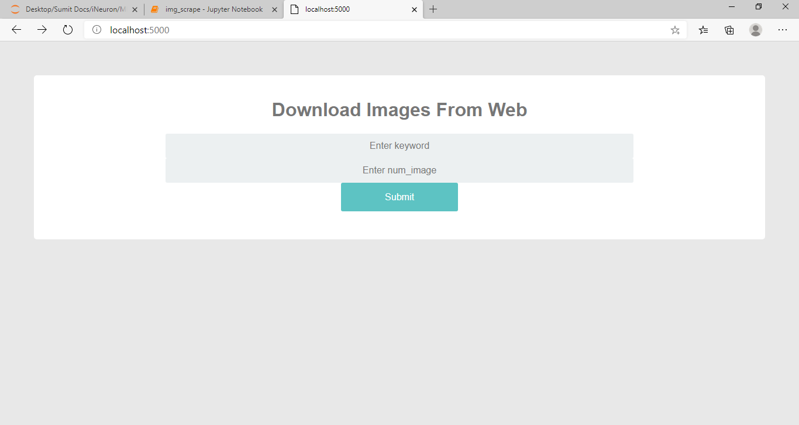
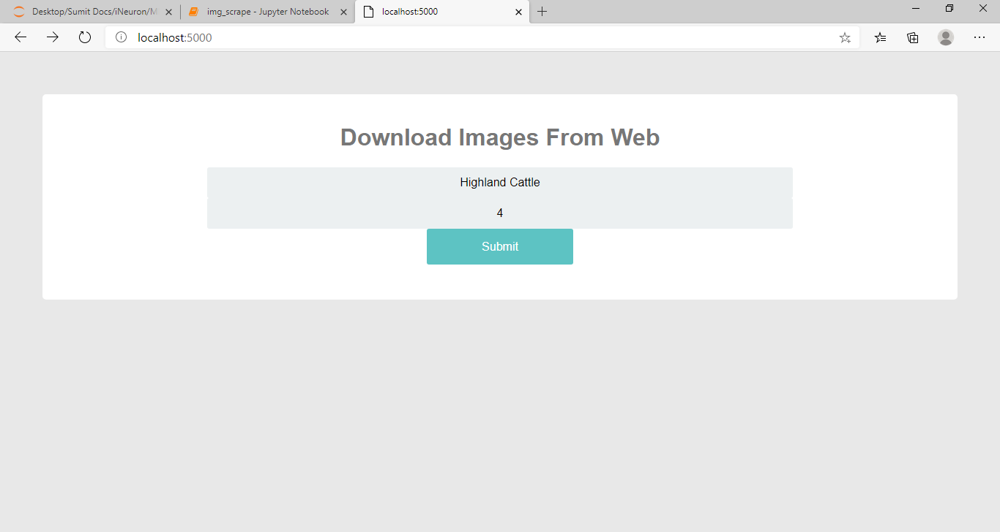
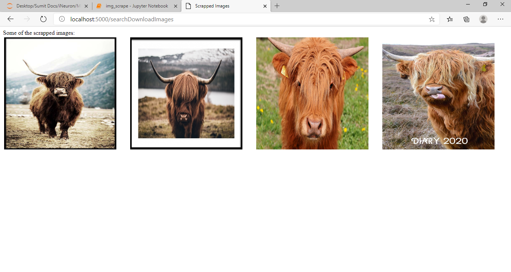

# Project ImageScrapper
The main objective of this project is to scrap images from [Google Image](https://images.google.com/?gws_rd=ssl).
- ## Programming Language:
  - Python
  - Libraries
    - Flask
    - BeautifulSoup4
    - Selenium
    - os
    - webdriver
  - HTML5
  - CSS3
  
 - ## Deployment:
 
 Cloud: **Heroku**
 
 Website Link: [ImageScrapper](https://boiling-refuge-92515.herokuapp.com/)
 
 **Note:** Above link is only available for a limited period as this is deployed onto a free-tier Heroku cloud on an experimental basis.
 
 Below given are the screen shots from the testing of code on Heroku:
 
 - ## Home Page:
 
 
 - ## Result Page:
  
 
- ## CheckPoints while refreshing the page from chrome browser:
 While refreshing the page from Google Chrome, it was caching the image. Due to that reason it is not able to refresh the image even if i try to download a different set of images. To avoid this i have followed the below:
  - [Stack Overflow Link](https://stackoverflow.com/questions/5690269/disabling-chrome-cache-for-website-development)
  - Added the chrome extension [Classic Cache Killer](https://chrome.google.com/webstore/detail/classic-cache-killer/kkmknnnjliniefekpicbaaobdnjjikfp/related) to chrome browser
  
 Below given are the screen shots from the testing of code on Local Machine:
 
 - ## Home Page:
 
 
 
 
  - ## Result Page:
  
 
